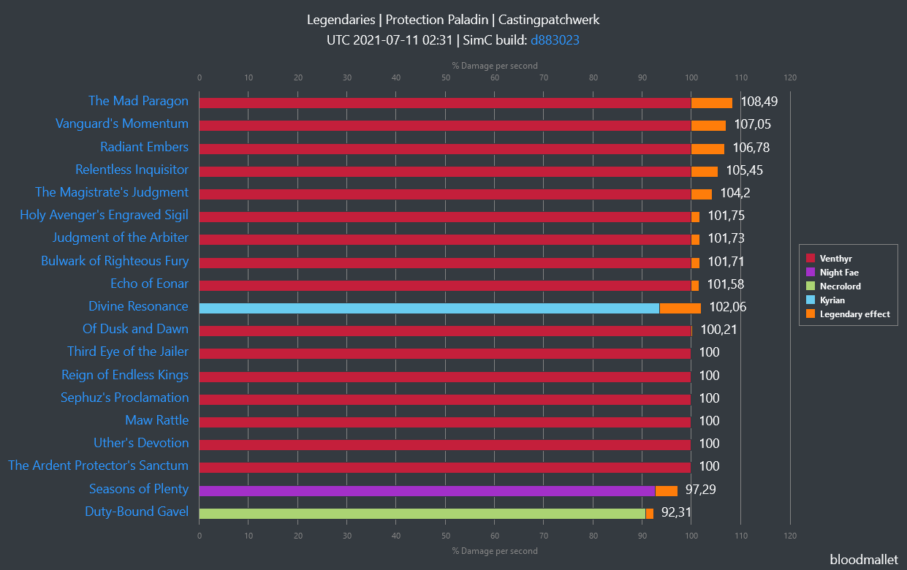

# Fallback profiles
## What?
Fallback profiles are used if 
[SimulationCraft](https://github.com/simulationcraft/simc) doesn't
have some profiles. E.g. for specific fight styles.

## Why?
If you want your spec to be simulated in e.g. `castingpatchwerk3` with a
different profile than the current SimulationCraft stacked chart profile,
you can provide a fitting profile here.

## How?
Provide and update a profile via 
[Pull Request](https://github.com/Bloodmallet/bloodytools/pulls) (against 
`dev`-branch) or 
[Ticket](https://github.com/Bloodmallet/bloodytools/issues/new) in 
[bloodytools](https://github.com/Bloodmallet/bloodytools).

### Naming scheme
Files need to follow SimulationCrafts naming scheme: `T<NUMBER>_<CLASS>_<SPEC>[_<COVENANT>].simc`
E.g.:
- T27_Shaman_Elemental.simc
- T27_Shaman_Elemental_Night_Fae.simc
- T27_Warrior_Fury_Venthyr.simc

### Location
Files need to be placed in an appropriate sub-directory next to this file. Directory scheme: `<FIGHT_STYLE>/Tier<NUMBER>/`. FIGHT_STYLE needs to be in lower cases.
E.g. full file path:
- `/fallback_profiles/README.md` we're here
- `/fallback_profiles/castingpatchwerk3/Tier27/T27_Shaman_Elemental.simc` will overwrite SimulationCrafts base profile for Elemental Shaman simultions using the CastingPatchwerk3 fight style.

## Order
Profiles are loaded in the following order. If a profile was loaded successfully it'll be used.
1. Custom profile, if one was submitted/enabled
2. fallback profile from `/fallback_profiles`
3. SimulationCraft profile
